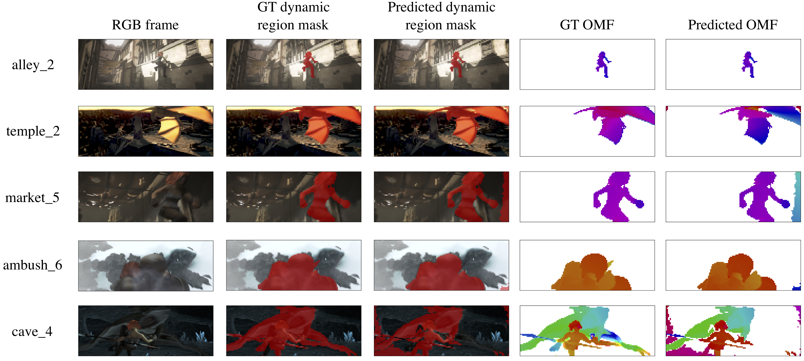

## Sparse Representations for Object and Ego-motion Estimation in Dynamic Scenes

Authors: [Hirak J. Kashyap](https://www.ics.uci.edu/~kashyaph/), [Charless C. Fowlkes](https://www.ics.uci.edu/~fowlkes/), [Jeffrey L. Krichmar](http://www.socsci.uci.edu/~jkrichma/) 

This paper appears in: IEEE Transactions on Neural Networks and Learning Systems

Link: [Full paper](https://doi.org/10.1109/TNNLS.2020.3006467)

Digital Object Identifier: 10.1109/TNNLS.2020.3006467

### Abstract

Disentangling the sources of visual motion in a dynamic scene during self-movement or ego motion is important for autonomous navigation and tracking. In the dynamic image segments of a video frame containing independently moving objects, optic flow relative to the next frame is the sum of the motion fields generated due to camera and object motion. The traditional ego-motion estimation methods assume the scene to be static, and the recent deep learning-based methods do not separate pixel velocities into object- and ego-motion components. We propose a learning-based approach to predict both ego-motion parameters and object-motion field (OMF) from image sequences using a convolutional autoencoder while being robust to variations due to the unconstrained scene depth. This is achieved by: 1) training with continuous ego-motion constraints that allow solving for ego-motion parameters independently of depth and 2) learning a sparsely activated overcomplete ego-motion field (EMF) basis set, which eliminates the irrelevant components in both static and dynamic segments for the task of ego-motion estimation. In order to learn the EMF basis set, we propose a new differentiable sparsity penalty function that approximates the number of nonzero activations in the bottleneck layer of the autoencoder and enforces sparsity more effectively than L1- and L2-norm-based penalties. Unlike the existing direct ego-motion estimation methods, the predicted global EMF can be used to extract OMF directly by comparing it against the optic flow. Compared with the state-of-the-art baselines, the proposed model performs favorably on pixelwise object- and ego-motion estimation tasks when evaluated on real and synthetic data sets of dynamic scenes.

### Requirements
scikit-image
pypng
path.py
tensorboardX
tensorflow
cupy-cuda90
tqdm
opencv-python

### Acknowledgement
This work was supported in part by NSF grants IIS- 1813785, CNS-1730158, and IIS-1253538. We are thankful to CHASE-CI for providing computing resources.
